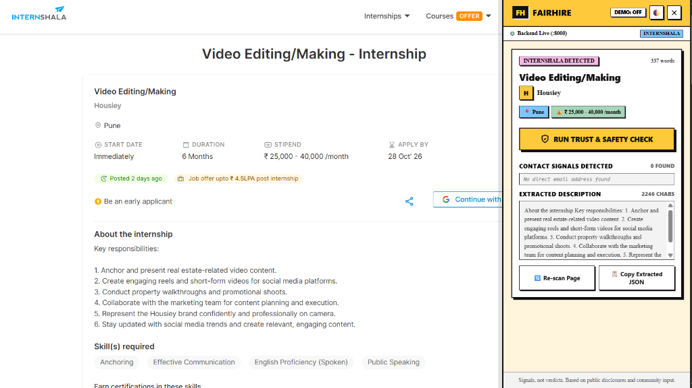
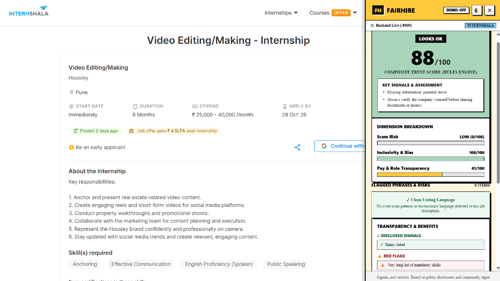
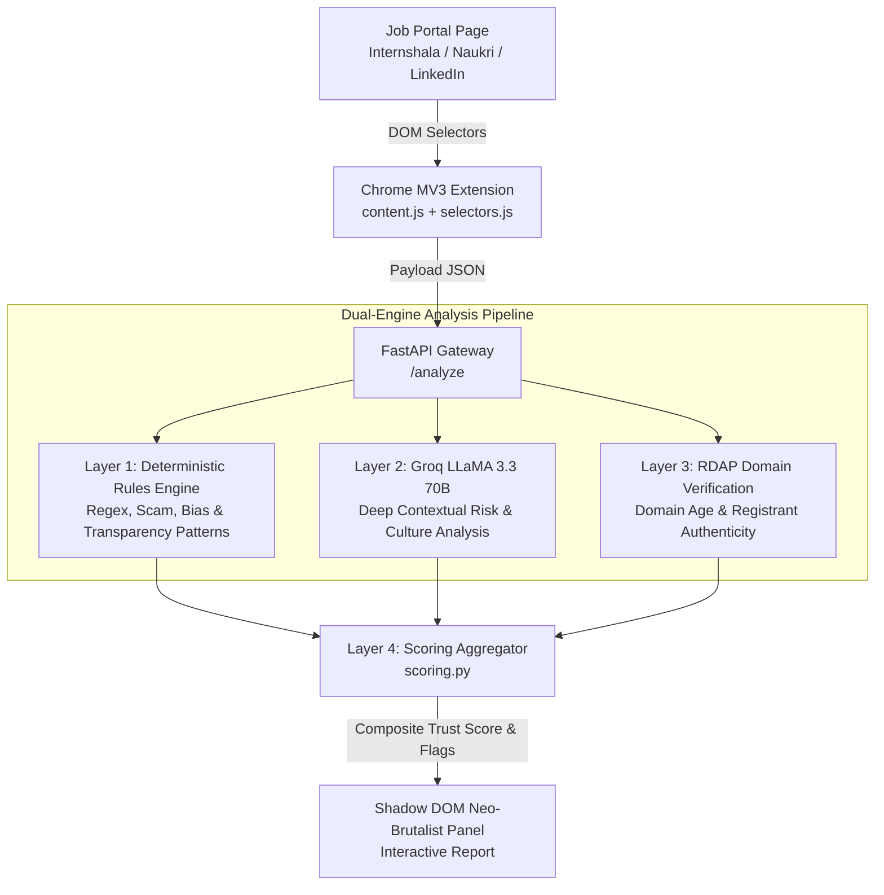

# FairHire 🛡️
> **Job Trust & Safety Co-pilot**  
> *"Job boards tell you what companies want. FairHire tells you what they won't: is it a scam, is it safe, is it worth your time."*

[](https://developer.chrome.com/docs/extensions/mv3/)
[](https://fastapi.tiangolo.com/)
[-F55036)](https://groq.com/)
[](backend/)
[](extension/)

**FairHire** is an intelligent browser extension and backend verification engine designed to protect job seekers across top employment portals (such as **Internshala**, **Naukri**, and **LinkedIn**). By pairing deterministic rule-based pattern matching with fast LLM reasoning and domain authentication, FairHire flags predatory scams, unmasks toxic bias, assesses pay transparency, and calculates an actionable **Composite Trust Score (0–100)** in real time.

---

## 📸 In Action: Real-World Example on Internshala

Below is FairHire running live on an actual Internshala internship listing, demonstrating automatic page reading followed by an in-depth trust and safety audit:

| 1. Auto-Detection & Extraction | 2. Real-Time Trust & Safety Report |
| :---: | :---: |
|  |  |
| *FairHire identifies portal selectors, extracts job title, company, stipend, duration, and full description.* | *Instant composite score (88/100), dimensional breakdown, scam risk audit, and disclosed benefits.* |

---

## 🎯 Why FairHire?

Every day, thousands of candidates—especially students and early-career job seekers—fall victim to:
1. **Employment Frauds**: Advance fee scams disguised as "laptop deposits", "mandatory training certificates", or redirection to unverified WhatsApp/Telegram recruiters.
2. **Ghost & Misleading Listings**: Unrealistic salary promises with non-disclosed compensations, unverified recruiter domains, or hidden commissions.
3. **Toxic Culture & Covert Bias**: Aggressive "work late 24x7 / rockstar" expectations, gendered language, and exclusionary requirements.
4. **Missing Employee Protections**: Total omission of parental leave policies, POSH (Prevention of Sexual Harassment) compliance, or work-life balance disclosures.

FairHire acts as an objective, candidate-first advocate that sits directly in your browser.

---

## ✨ Core Features

### 🛡️ 1. Multi-Vector Scam Detection
- **Fee Demands**: Flags keywords asking for security deposits, registration fees, verification fees, or training payments.
- **Off-Platform Redirections**: Detects requests to message recruiters via WhatsApp, Telegram, or personal mobile numbers.
- **Suspicious Contact Channels**: Flags corporate hiring coming from free personal webmails (`@gmail.com`, `@yahoo.com`) instead of authentic business domains.
- **Domain Age & RDAP Checks**: Performs real-time domain age verification; flags recently registered domains (<6 months old) masquerading as established employers.

### ⚖️ 2. Inclusivity & Workplace Culture Audit
- **Gendered & Biased Vocabulary**: Detects aggressive masculine-coded wording (`rockstar`, `crush it`, `dominant`, `aggressive`) and exclusionary language.
- **Overtime & Exploitation Alerts**: Spots red flags such as *"work late"*, *"24x7 availability"*, *"high pressure tolerance"*, and *"unpaid probation"*.
- **One-Click Rewrites**: Generates candidate-friendly neutral alternative phrases with a one-click copy button (`📋 Copy Rewrite`).

### 📊 3. Pay & Role Transparency Index
- **Clear Compensation**: Validates whether true salary/stipend ranges are disclosed or hidden behind *"industry standard"* or *"best in market"*.
- **Mandatory Benefits**: Checks for explicit statements regarding parental leave, health insurance, and workplace harassment (POSH) safeguards.
- **Role Expectation Balance**: Flags disproportionate requirement lists (e.g. 15+ mandatory tools for an entry-level internship).

### ⚡ 4. Robust Neo-Brutalist Shadow DOM UI
- **Zero Host Style Bleed**: Rendered inside a closed `ShadowRoot`—guarantees the side panel never breaks or conflicts with portal CSS.
- **High-Contrast Neo-Brutalist Aesthetic**: Built with bold borders, distinct hard shadows (`var(--fh-shadow)`), clean badges, and clear visual hierarchy.
- **Offline / Demo Mode**: Built-in toggle allows full evaluation using bundled deterministic models and offline fixtures with zero API latency.
- **Dark & Light Mode**: Native theme toggle with responsive contrast adaptation.

---

## 🔬 How FairHire Works (Architecture)

FairHire utilizes a **four-layer hybrid pipeline** ensuring speed, accuracy, and absolute resilience against API outages:



### 1. Dual-Engine Scoring Logic
- **Deterministic Rules (`rules_engine.py`)**: Executes in <5ms using curated JSON rules (`scam.json`, `bias.json`, `transparency.json`, `green_flags.json`).
- **Contextual LLM (`llm.py`)**: Uses Groq (`llama-3.3-70b-versatile`) with a strict JSON contract schema and hallucination guards.
- **Scoring Formula (`scoring.py`)**:
  - Base Score: Starts at **70**.
  - **Scam Penalty**: Heavy penalty (up to `-60`). If scam score > 50, composite trust is capped at **25** (`High Risk / Likely Scam`).
  - **Inclusivity & Bias**: Penalties for exclusionary phrases (`-5` to `-15`), balanced against inclusivity rewards.
  - **Transparency & Disclosures**: Boosts score (`+5` to `+15`) for explicit compensation, POSH compliance, and clear role boundaries.

### Score Verdict Ranges

| Range | Verdict | Badge Color | Meaning |
| :---: | :---: | :---: | :--- |
| **80 – 100** | **LOOKS OK** | 🟢 Green / Dark | High confidence listing. Clear salary, legitimate company signals, and clean language. |
| **50 – 79** | **NEEDS REVIEW** | 🟡 Yellow / Amber | Moderate risk. Potential vague responsibilities, aggressive culture signals, or missing benefits. |
| **0 – 49** | **HIGH RISK / SCAM** | 🔴 Red | High scam probability, fee requests, suspicious redirects, or severe bias. |

---

## 📁 Repository Structure

```text
FairHire/
├── backend/
│   ├── main.py                    # FastAPI app & endpoints (/health, /analyze, mock routes)
│   ├── pipeline.py                # Dual-engine pipeline orchestrator (Rules + LLM + Domain)
│   ├── rules_engine.py            # Deterministic regex evaluator for scams, bias, & perks
│   ├── scoring.py                 # Multi-factor score clamping, weighting, and verdict logic
│   ├── llm.py                     # Groq LLaMA 3.3 integration with schema validation
│   ├── domain_checks.py           # RDAP domain age & suspicious registrar verification
│   ├── enrichment.py              # Company profile & verification signals
│   ├── config.py                  # Environment settings & configuration loader
│   ├── requirements.txt           # Python dependencies (FastAPI, uvicorn, groq, etc.)
│   ├── test_rules.py              # Step 3 unit tests (100% offline, deterministic)
│   ├── test_step4.py              # Step 4 unit tests (LLM parser, pipeline merge, fallback)
│   └── test_step3_integration.py  # End-to-end integration test against running server
├── data/
│   ├── contract.json              # Strict JSON API contract schema
│   ├── demo_analysis.json         # Standalone canned fallback analysis
│   ├── aliases.json               # Company alias resolution database
│   └── rules/                     # Curated rules database
│       ├── scam.json              # Fee demands, chat app redirects, urgency patterns
│       ├── bias.json              # Gendered terms, age limits, availability pressure
│       ├── transparency.json      # Missing compensation, vague expectations
│       └── green_flags.json       # Disclosed salary, POSH statements, parental leave
├── extension/
│   ├── manifest.json              # Chrome Manifest V3 declaration
│   ├── background.js              # Service worker (timeout handling, offline fallback)
│   ├── content.js                 # Shadow DOM Neo-Brutalist Trust Report UI controller
│   ├── selectors.js               # Multi-portal DOM extraction selectors (Internshala, Naukri, LinkedIn)
│   ├── panel.css                  # Neo-Brutalist CSS styles (borders, shadows, dark mode)
│   ├── mock_internshala.html      # Internshala test fixture
│   ├── mock_scam.html             # High-risk recruitment scam test fixture
│   ├── mock_test.html             # Naukri-style test fixture
│   └── icons/                     # Extension branding icons
└── docs/
    ├── SCORING.md                 # Detailed scoring formula, weights & mathematical model
    └── screenshots/               # High-resolution screenshots of the extension in action
        ├── internshala_job_detected.png
        └── internshala_trust_analysis.png
```

---

## 🚀 Quickstart Guide

### 1. Prerequisites
- **Python**: 3.10 or higher
- **Browser**: Google Chrome or Chromium-based browser (Brave, Edge)
- **API Key** *(Optional)*: [Groq API Key](https://console.groq.com/) for real-time LLaMA 3.3 reasoning (if omitted, deterministic rules engine runs automatically).

---

### 2. Backend Setup

```bash
# 1. Navigate to the backend directory
cd backend

# 2. Create and activate a virtual environment
python -m venv .venv
# On Windows PowerShell:
.venv\Scripts\Activate.ps1
# On macOS / Linux:
source .venv/bin/activate

# 3. Install dependencies
pip install -r requirements.txt

# 4. Set up environment variables
cp .env.example .env
# Open .env and insert your GROQ_API_KEY (optional, fallback rules work out-of-the-box)

# 5. Start the backend server
python -m uvicorn main:app --reload --host 127.0.0.1 --port 8000
```

Verify backend health at: [http://127.0.0.1:8000/health](http://127.0.0.1:8000/health)

---

### 3. Chrome Extension Setup

1. Open Google Chrome and navigate to `chrome://extensions/`.
2. Enable **Developer mode** using the toggle switch in the top-right corner.
3. Click **Load unpacked**.
4. Select the `extension/` folder inside this repository:
   ```text
   c:\Users\suhav\OneDrive\Desktop\FairHire\extension
   ```
5. The **FairHire: Job Trust & Safety Co-pilot** icon will appear in your Chrome toolbar.

---

### 4. Running the Tests

FairHire includes 24 automated unit and integration tests covering the rules engine, pipeline merge, LLM fallback, and error handling:

```bash
cd backend
python -m unittest test_rules test_step4 -v
```

Output:
```text
Ran 24 tests in 0.082s

OK
```

---

## 🖥️ Live Testing & Walkthrough

You can test FairHire either on live websites or using the included mock test fixtures:

### A. Live Portal Testing
1. Visit any job listing on [Internshala](https://internshala.com) or [Naukri](https://www.naukri.com).
2. The yellow **"🛡️ Check This Job"** badge appears floating on the right side.
3. Click the badge to dock the FairHire panel.
4. Click **"Run Trust & Safety Check"** to receive instant scores, red flags, and disclosed benefits.

### B. Mock Scam Fixture
1. With the backend running, visit [http://127.0.0.1:8000/test-scam](http://127.0.0.1:8000/test-scam) in Chrome.
2. Trigger the check to see the **High Risk / Likely Scam** verdict, with flags for advance fees, personal webmail, and urgent WhatsApp onboarding.

### C. Offline / Demo Mode
- Click the **"DEMO: OFF"** pill in the panel header to toggle to **"DEMO: ON"**.
- FairHire will use instant local contract data—ideal for presentations, offline environments, or zero-latency testing.

---

## 🔒 Privacy & Safety Principles

- **No Scraping of Gated Communities**: FairHire does not scrape Glassdoor or AmbitionBox. It provides direct, clean deep-links so users can read authentic community feedback.
- **Privacy-First**: No candidate personal data, resumes, or tracking cookies are collected or sent. Only the public job posting content is processed.
- **Graceful Degradation**: If network drops or an LLM times out, FairHire seamlessly falls back to its deterministic rule engine with zero disruption to the user.

---

## 📄 License
This project is open-source under the [MIT License](LICENSE).
